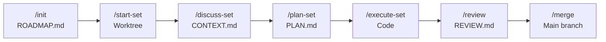

# PLAN: documentation / Wave 1 -- README.md Rewrite

## Objective

Rewrite README.md as the open-source front door for RAPID. The current README references "v3.0" and "26 agents" -- both stale. The new README must present RAPID v4.4.0 accurately with a rich overview that lets technical evaluators assess the project from a single page.

## Source of Truth

- Agent count: 27 (count files in `agents/` directory)
- Skill count: 28 (count directories in `skills/` directory, excluding `.test.cjs` files)
- Version: v4.4.0
- SKILL.md files in each `skills/*/` directory are canonical for command descriptions

## Tasks

### Task 1: Rewrite README.md

**File:** `README.md`

**Action:** Rewrite the entire file. Preserve the overall narrative structure (Problem, Install, Quickstart, How It Works, Architecture, Command Reference, Example, License) but update all content to reflect v4.4.0.

**Specific changes required:**

1. **Header paragraph:** Update "RAPID v3.0" to "RAPID v4.4.0". Update "26 specialized agents" to "27 specialized agents". Keep the rest of the value proposition intact -- it reads well.

2. **The Problem section:** Keep as-is -- it is accurate and compelling.

3. **Install section:** Keep as-is -- `claude plugin add pragnition/RAPID` and `/rapid:install` are still correct.

4. **60-Second Quickstart:** Keep the command list. Update the description below it if needed. The current text is accurate.

5. **How It Works section:** Update the review pipeline description. The current text says `/rapid:review` runs scoper, unit-tester, bug-hunter, devils-advocate, judge, bugfix, and uat all in one command. This is now WRONG -- `/rapid:review` only scopes (produces REVIEW-SCOPE.md). Unit-test, bug-hunt, and uat are separate skills (`/rapid:unit-test`, `/rapid:bug-hunt`, `/rapid:uat`). Rewrite the "Adversarial review" paragraph to reflect this 4-skill architecture:
   - `/rapid:review` scopes the review (identifies files, categorizes by concern)
   - `/rapid:unit-test` generates and runs unit tests
   - `/rapid:bug-hunt` runs the adversarial bug-hunt cycle (hunter, devils-advocate, judge, bugfix)
   - `/rapid:uat` runs acceptance testing

6. **Architecture section:** The ASCII diagram is fine. Update the Agent Dispatch tree:
   - `/rapid:review` should only show `scoper`
   - Add `/rapid:unit-test` with `unit-tester (per concern group)`
   - Add `/rapid:bug-hunt` with `bug-hunter`, `devils-advocate`, `judge`, `bugfix`
   - Add `/rapid:uat` with `uat`
   - Update "26 agents total" to "27 agents total" and "5 core hand-written agents" stays correct. Update "21 generated agents" to "22 generated agents".

7. **Mermaid lifecycle flowchart:** Add a Mermaid diagram AFTER the Architecture heading and BEFORE the ASCII set diagram. The flowchart shows the linear lifecycle:



Each node shows the command name and its primary output artifact.

8. **Command Reference tables:** Update to include all 28 skills organized into 4 groups:
   - Core Lifecycle (7): init, start-set, discuss-set, plan-set, execute-set, review, merge
   - Auxiliary (4): status, install, new-version, add-set
   - Review Sub-commands (3): unit-test, bug-hunt, uat
   - Utilities (14): assumptions, audit-version, branding, bug-fix, bug-hunt (already in review), cleanup, context, documentation, help, migrate, pause, quick, register-web, resume, scaffold

   CORRECTION: Review Sub-commands (3): unit-test, bug-hunt, uat. These are listed separately from Utilities. The Utilities group then has 11 entries (not 14): assumptions, audit-version, branding, bug-fix, cleanup, context, documentation, help, migrate, pause/resume, quick, register-web, scaffold. Count carefully from the skills/ directory.

   Actually, the exact grouping should be:
   - Core Lifecycle (7): init, start-set, discuss-set, plan-set, execute-set, review, merge
   - Review Pipeline (3): unit-test, bug-hunt, uat
   - Auxiliary (4): status, install, new-version, add-set
   - Utilities (14): assumptions, audit-version, branding, bug-fix, cleanup, context, documentation, help, migrate, pause, quick, register-web, resume, scaffold

9. **Real-World Example:** Update the review step to show the split commands:
   ```
   /rapid:review 1              # Scope review targets
   /rapid:unit-test 1           # Generate and run unit tests
   /rapid:bug-hunt 1            # Adversarial bug hunting
   /rapid:uat 1                 # Acceptance testing
   ```
   Do the same for Dev B's example.

10. **Further Reading:** Replace the reference to `technical_documentation.md` with a reference to `DOCS.md` and `docs/` directory. The line should read something like: "For the full technical reference -- all 28 commands with detailed usage, agent architecture, state machines, and configuration -- see [DOCS.md](DOCS.md)."

11. **Remove** the reference to `technical_documentation.md` entirely. Do NOT delete the file itself (that is outside this set's ownership).

**What NOT to do:**
- Do not delete `technical_documentation.md` -- it is not in this set's owned files
- Do not change the license section
- Do not add badges or shields -- keep it clean
- Do not add a table of contents -- the README is scannable without one
- Do not use emojis

**Verification:**
```bash
# Check no stale "v3.0" reference remains
! grep -q "RAPID v3.0" README.md
# Check agent count is updated
grep -q "27" README.md
# Check no reference to technical_documentation.md
! grep -q "technical_documentation.md" README.md
# Check Mermaid diagram exists
grep -q "flowchart" README.md
# Check review sub-commands are documented
grep -q "unit-test" README.md && grep -q "bug-hunt" README.md && grep -q "uat" README.md
```

## Success Criteria

- README.md accurately represents RAPID v4.4.0
- All 28 skills are referenced in the command tables
- Mermaid lifecycle diagram is present and correct
- Review pipeline reflects the 4-skill split architecture
- No references to `technical_documentation.md`
- No stale version numbers or agent counts
