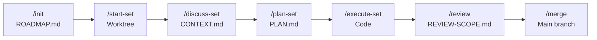

# RAPID

**Rapid Agentic Parallelizable and Isolatable Development**

A Claude Code plugin for coordinated parallel AI-assisted development. RAPID v4.4.0 gives each developer an isolated worktree with strict file ownership, connects workstreams through machine-verifiable interface contracts, and merges everything back through a multi-level conflict detection and resolution pipeline. 27 specialized agents handle the automation so developers focus on decisions, not coordination.

---

## The Problem

Claude Code is powerful for a solo developer. But the moment two developers use it on the same project, everything breaks.

Developer A's agent rewrites a utility file while Developer B's agent imports from it. Nobody owns any file, so agents overwrite each other's work. Merge conflicts pile up because there's no coordination layer between independent Claude sessions. Even when code merges cleanly at the text level, semantic conflicts slip through -- incompatible API changes, duplicated abstractions, contradictory design decisions.

The core issue is not Claude Code itself. Parallel AI-assisted development needs the same things parallel human development needs: isolation, ownership, contracts, and a structured merge strategy. Without those, you are not doing parallel development -- you are doing concurrent chaos.

RAPID solves this.

## Install

```
claude plugin add pragnition/RAPID
```

Then run `/rapid:install` inside Claude Code to configure your environment.

## 60-Second Quickstart

```
/rapid:init              # Research project, generate roadmap, decompose into sets
/rapid:start-set 1       # Create isolated worktree for set 1
/rapid:discuss-set 1     # Capture your implementation vision
/rapid:plan-set 1        # Research, plan all waves, validate contracts
/rapid:execute-set 1     # Execute all waves (parallel agents per wave)
/rapid:review 1          # Scope review targets
/rapid:unit-test 1       # Generate and run unit tests
/rapid:bug-hunt 1        # Adversarial bug hunting
/rapid:uat 1             # Acceptance testing
/rapid:merge             # Integrate completed sets to main
```

That is the full lifecycle. Each command spawns specialized agents, produces artifacts, and advances the set through its lifecycle automatically.

## How It Works

RAPID structures parallel work around **sets** -- independent workstreams that each developer owns end-to-end.

**Research pipeline.** Before any code is written, `/rapid:init` spawns 6 parallel researchers (stack, features, architecture, pitfalls, oversights, UX) to analyze your project. A synthesizer combines their findings, and a roadmapper decomposes work into sets with clear boundaries.

**Interface contracts.** Sets connect through `CONTRACT.json` -- machine-verifiable specifications that define exactly which functions, types, and endpoints each set exposes. If Set A needs a function from Set B, the contract enforces that Set B actually exports it with the right signature. Contracts are validated after planning, during execution, and before merge.

**Planning with validation.** `/rapid:plan-set` runs a 3-step pipeline: a researcher investigates implementation specifics, a planner produces wave-level plans, and a verifier checks for coverage gaps, contract violations, and inconsistencies. Total: 2-4 agent spawns per set.

**Execution with per-wave agents.** `/rapid:execute-set` runs one executor agent per wave, sequentially through the wave dependency order. Each executor implements the planned work, commits atomically, and reports results. A verification agent checks objectives after all waves complete. If interrupted, re-running detects completed work from planning artifacts and resumes where it left off.

**4-stage review pipeline.** Review is split into four independent skills that run sequentially after execution:

- `/rapid:review` scopes the review -- identifies changed files, categorizes them by concern area, and produces a REVIEW-SCOPE.md that downstream skills consume.
- `/rapid:unit-test` generates and runs unit tests against each concern group identified by the scoper.
- `/rapid:bug-hunt` runs the adversarial bug-hunt cycle: a hunter finds issues, a devil's advocate challenges the findings, and a judge rules on each dispute. Confirmed bugs are fixed automatically. This cycle iterates up to 3 times.
- `/rapid:uat` runs acceptance testing with browser automation to verify end-to-end behavior.

**Multi-level merge.** `/rapid:merge` detects conflicts at 5 levels (textual, structural, dependency, API, semantic) and resolves them through a 4-tier confidence cascade. High-confidence resolutions are auto-accepted, mid-confidence conflicts go to dedicated resolver agents, and low-confidence conflicts escalate to the developer. Clean merges skip detection entirely via a fast-path `git merge-tree` check.

## Architecture



```
Milestone (v1.0, v2.0, ...)
├── Set 1 (Dev A)     -- isolated worktree + branch
├── Set 2 (Dev B)     -- isolated worktree + branch
└── Set 3 (Dev C)     -- isolated worktree + branch
```

Each set runs in full isolation: its own git worktree, its own branch, its own CLAUDE.md with scoped context. Developers work in parallel without touching each other's files.

### Agent Dispatch

Skills dispatch agents directly -- each command spawns exactly the agents it needs:

```
/rapid:init
  ├── 6 researchers (parallel)     -- stack, features, architecture, pitfalls, oversights, UX
  ├── synthesizer                  -- combines research findings
  ├── codebase-synthesizer         -- analyzes existing code (brownfield)
  └── roadmapper                   -- decomposes into sets

/rapid:plan-set
  ├── research-stack               -- implementation research
  ├── planner                      -- wave plans with contracts
  └── plan-verifier                -- validates coverage and consistency

/rapid:execute-set
  ├── executor (per wave)          -- implements planned work
  └── verifier                     -- checks objectives post-execution

/rapid:review
  └── scoper                       -- identifies review targets, produces REVIEW-SCOPE.md

/rapid:unit-test
  └── unit-tester (per concern)    -- generates and runs tests

/rapid:bug-hunt
  ├── bug-hunter                   -- finds issues
  ├── devils-advocate              -- challenges findings
  ├── judge                        -- rules on disputes
  └── bugfix                       -- fixes confirmed bugs

/rapid:uat
  └── uat                          -- acceptance testing with browser automation

/rapid:merge
  ├── set-merger (per set)         -- 5-level conflict detection
  └── conflict-resolver (per conflict) -- resolves mid-confidence conflicts
```

27 agents total: 4 core hand-written agents with full control over their domain, 23 generated agents with embedded tool documentation.

## Command Reference

### 7 Core Lifecycle Commands

| Command | Description |
|---------|-------------|
| `/rapid:init` | Research project, generate roadmap, decompose into sets |
| `/rapid:start-set` | Create isolated worktree, generate scoped CLAUDE.md |
| `/rapid:discuss-set` | Capture developer implementation vision before planning |
| `/rapid:plan-set` | Plan all waves in a set -- research, plan, validate |
| `/rapid:execute-set` | Execute all waves with per-wave executor agents |
| `/rapid:review` | Scope review targets and produce REVIEW-SCOPE.md |
| `/rapid:merge` | Merge completed sets to main with conflict detection |

### 3 Review Pipeline Commands

| Command | Description |
|---------|-------------|
| `/rapid:unit-test` | Generate and run unit tests per concern group |
| `/rapid:bug-hunt` | Adversarial bug hunt -- hunter, devil's advocate, judge, bugfix |
| `/rapid:uat` | Acceptance testing with browser automation |

### 4 Auxiliary Commands

| Command | Description |
|---------|-------------|
| `/rapid:status` | Project dashboard with set statuses and next actions |
| `/rapid:install` | Plugin installation and shell configuration |
| `/rapid:new-version` | Start new milestone/version cycle |
| `/rapid:add-set` | Add sets mid-milestone with contract updates |

### 14 Utilities

| Command | Description |
|---------|-------------|
| `/rapid:assumptions` | Surface Claude's assumptions about a set before execution |
| `/rapid:audit-version` | Audit completed milestone for gaps between plan and delivery |
| `/rapid:branding` | Structured branding interview with codebase-aware guidelines |
| `/rapid:bug-fix` | Investigate and fix a reported bug |
| `/rapid:cleanup` | Remove worktrees for merged sets |
| `/rapid:context` | Generate codebase context files for brownfield projects |
| `/rapid:documentation` | Generate and maintain project documentation from history |
| `/rapid:help` | Command reference and workflow guide |
| `/rapid:migrate` | Migrate .planning/ state from older RAPID versions |
| `/rapid:pause` | Save set state for later resumption |
| `/rapid:quick` | Ad-hoc changes without requiring set structure |
| `/rapid:register-web` | Register project with RAPID Mission Control dashboard |
| `/rapid:resume` | Resume a paused set from where it left off |
| `/rapid:scaffold` | Generate project-type-aware foundation files |

**Note:** Commands accepting set IDs support both string names (e.g., `auth-system`) and numeric shorthand (e.g., `1`).

## Real-World Example

Two developers building a SaaS application. Dev A handles authentication, Dev B handles the dashboard.

**Setup (once, by any developer):**

```
/rapid:init
```

RAPID researches the project, identifies two independent workstreams, and generates a roadmap with Set 1 (auth) and Set 2 (dashboard). A `CONTRACT.json` specifies that the dashboard depends on auth's `getCurrentUser()` and `requireAuth()` middleware.

**Dev A (auth system):**

```
/rapid:start-set 1          # Creates worktree at worktrees/auth-system/
/rapid:discuss-set 1         # "I want JWT with refresh token rotation"
/rapid:plan-set 1            # Plans 2 waves: models+middleware, then routes
/rapid:execute-set 1         # Agents implement both waves
/rapid:review 1              # Scope review targets
/rapid:unit-test 1           # Generate and run unit tests
/rapid:bug-hunt 1            # Adversarial bug hunting
/rapid:uat 1                 # Acceptance testing
```

**Dev B (dashboard), at the same time:**

```
/rapid:start-set 2           # Creates worktree at worktrees/dashboard/
/rapid:discuss-set 2          # "React with server components, charts with Recharts"
/rapid:plan-set 2             # Plans 3 waves: layout, data fetching, charts
/rapid:execute-set 2          # Agents implement all waves
/rapid:review 2               # Scope review targets
/rapid:unit-test 2            # Generate and run unit tests
/rapid:bug-hunt 2             # Adversarial bug hunting
/rapid:uat 2                  # Acceptance testing
```

Dev A and Dev B work simultaneously in separate worktrees. The contract ensures Dev B's dashboard code calls `getCurrentUser()` with the exact signature Dev A's auth system exports.

**Merge (after both sets pass review):**

```
/rapid:merge
```

RAPID merges auth first (no dependencies), then dashboard. The merge pipeline validates that the contract between the two sets is satisfied -- `getCurrentUser()` exists, returns the right type, and is exported from the right module. If there are conflicts, dedicated resolver agents handle them automatically.

```
/rapid:cleanup 1
/rapid:cleanup 2
```

Worktrees removed. Both sets are on main.

## Further Reading

For the full technical reference -- all 28 commands with detailed usage, agent architecture, state machines, and configuration -- see [DOCS.md](DOCS.md).

## License

MIT -- see [LICENSE](LICENSE).
