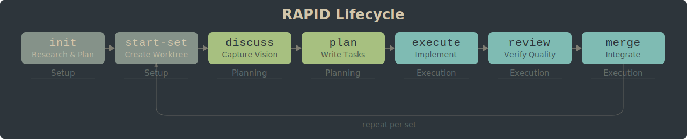
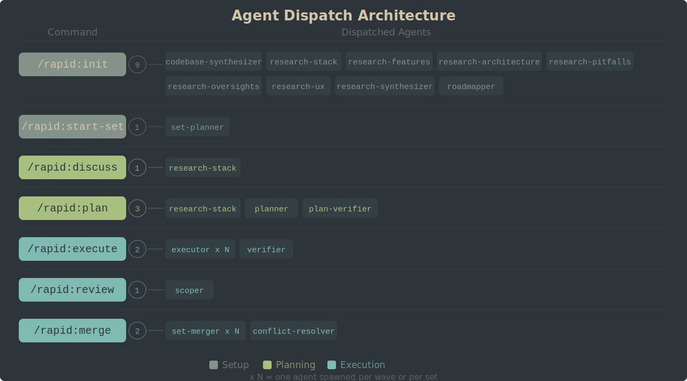

<p align="center">
  
</p>

<p align="center">
   
   
   
  
</p>

<p align="center">
  <sub>Made with :heart: by <a href="https://github.com/fishjojo1">@fishjojo1</a></sub>
</p>

> [!NOTE]
> RAPID is still in beta. Therefore, features may be broken/unpolished. Feedback is **always** welcome.

You are deep into a Claude session -- twenty minutes in, the model has seen your architecture,
your test suite, your style conventions. Then it starts repeating itself. It forgets a decision
you made five prompts ago. It hallucinates a function signature it generated correctly earlier.
That is context rot: as the context window fills, the model loses grip on earlier decisions and
artifacts, and quality degrades in ways you cannot predict. RAPID solves this by structuring
work into isolated sets with `/clear` between every command, so each step gets a fresh context
window loaded with exactly the artifacts it needs -- nothing more, nothing stale.

## Install

> [!TIP]
> Inside Claude Code:
>```
>/plugin install rapid@pragnition/pragnition-public-plugins 
>```
>
>Then, 
>
>```
>/rapid:install
>
> Next, restart your terminal/source your shell
>```

Requires Node.js 22+. For alternative installation methods, see [DOCS.md](DOCS.md#installation).

## The /clear Mental Model

After every RAPID command that produces artifacts, a box appears telling you to run `/clear` and what command comes next. This is intentional -- clearing context between steps keeps each command focused and prevents the degradation that ruins long sessions.

18 of 30 commands show this footer. Informational commands like `/rapid:status` and `/rapid:help` do not -- they consume minimal context and produce no artifacts.

Throughout this README, you will see `/clear` between every command. This is the pattern.

## Quickstart

1. **`/rapid:init`** -- Research your project, generate a roadmap, decompose work into sets
   > /clear

2. **`/rapid:start-set 1`** -- Create an isolated worktree for the first set
   > /clear

3. **`/rapid:discuss-set 1`** -- Capture your implementation vision and design decisions
   > /clear

4. **`/rapid:plan-set 1`** -- Research, produce wave-level plans, validate contracts
   > /clear

5. **`/rapid:execute-set 1`** -- Execute all planned waves with parallel agents
   > /clear

6. **`/rapid:review 1`** -- Scope the set for review (then optionally: unit-test, bug-hunt, uat)
   > /clear

7. **`/rapid:merge`** -- Integrate the completed set into main
   > /clear

Each command spawns specialized agents, produces artifacts, and advances the set through its lifecycle. The `/clear` between each step is not optional -- it is what keeps the whole system working.

> [!TIP]
> RAPID does not confine you to parallel development. Pass `--solo` to any command to work without worktrees.

## Your First Project

This walkthrough assumes you have installed RAPID and have a project you want to work on.

**Step 1: Install and configure.**
Run `/plugin install rapid@pragnition/pragnition-public-plugins `, then `/rapid:install` inside Claude Code. Install configures the RAPID_TOOLS environment variable and builds the agent files your project needs. Reload your terminal/shell to source the new environment variable.
> /clear

**Step 2: Initialize your project.**
Navigate to your project directory in Claude Code and run `/rapid:init`. RAPID will ask you questions about your project, then spawn 6 research agents in parallel to analyze your codebase. You will be presented with a roadmap of sets -- independent workstreams that can be developed in parallel. Approve or adjust the roadmap before continuing.
> /clear  

**Step 3(optional): Decide on your theming and branding.**
Run `/rapid:branding`. This starts an agent that walks through theming and UI decisions with you, spawning a local server for live testing. 

**Step 4: Start your first set.**
Run `/rapid:start-set 1`. This creates an isolated copy of your repo (a git worktree) where the first set's work will happen. No changes touch your main branch until you explicitly merge.
> /clear

**Step 5: Discuss implementation.**
Run `/rapid:discuss-set 1`. RAPID identifies design decisions where multiple valid approaches exist and asks for your input. Your answers are recorded into CONTEXT.md so the planner knows your intent.
> /clear

**Step 6: Plan.**
Run `/rapid:plan-set 1`. A researcher investigates your codebase, a planner produces task-level plans for each wave, and a verifier checks for gaps. You get PLAN.md files you can review before execution begins.
> /clear

**Step 7: Execute.**
Run `/rapid:execute-set 1`. One executor agent per wave implements the planned tasks with atomic commits. If something goes wrong, re-running the command resumes from where it left off.
> /clear  

**Step 8: Review and merge.**
Run `/rapid:review 1` to scope the changed files for review, then `/rapid:merge` to integrate the set branch into main with conflict detection. Optionally run `/rapid:unit-test 1`, `/rapid:bug-hunt 1`, or `/rapid:uat 1` between review and merge for additional validation.
> /clear

That is the full cycle for one set. In a real project, multiple sets run in parallel -- each developer owns a set end-to-end, and RAPID handles the coordination.

## Architecture

<p align="center">
  
</p>

<p align="center">
  
</p>

For a detailed explanation of how each stage works, see [DOCS.md](DOCS.md#architecture-overview).

## Command Reference

| Command | Description |
|---------|-------------|
| `/rapid:init` | Research project, generate roadmap, decompose into sets |
| `/rapid:start-set` | Create isolated worktree, generate scoped CLAUDE.md |
| `/rapid:discuss-set` | Capture developer implementation vision before planning |
| `/rapid:plan-set` | Plan all waves in a set -- research, plan, validate |
| `/rapid:execute-set` | Execute all waves with per-wave executor agents |
| `/rapid:review` | Scope review targets and produce REVIEW-SCOPE.md |
| `/rapid:merge` | Merge completed sets to main with conflict detection |

See [DOCS.md](DOCS.md) for the full reference covering all 30 commands.

## Changelog

See [CHANGELOG](docs/CHANGELOG.md) for full history. Latest: **v7.0.0** (in progress) -- see CHANGELOG for details.

## Documentation

-> [DOCS.md](DOCS.md) -- command reference, quick lookup, all 30 commands with usage examples

-> [Technical Documentation](technical_documentation.md) -- architectural narrative, system design rationale, how components fit together

-> [docs/](docs/) -- topic-specific deep-dives (agents, state machines, configuration, merge, review, and more)

## Credits 

Huge thanks to the work done by other opensource agent harnesses like [get-shit-done](https://github.com/gsd-build/get-shit-done) and [OpenSpec](https://github.com/gsd-build/get-shit-done). RAPID is heavily inspired by get-shit-done. In fact, earlier versions of RAPID were built using GSD till RAPID was good enough to build itself!

Another shoutout to [this article](https://www.humanlayer.dev/blog/skill-issue-harness-engineering-for-coding-agents) by humanlayer that served as a great info dump/starting point.

## Links

-> [Contributing Guide](CONTRIBUTING.md) -- how to contribute to RAPID

-> [License](LICENSE) -- MIT
