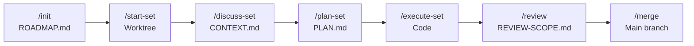

# RAPID Open-Source Presentation Implementation Plan

> **For agentic workers:** REQUIRED SUB-SKILL: Use superpowers:subagent-driven-development (recommended) or superpowers:executing-plans to implement this plan task-by-task. Steps use checkbox (`- [ ]`) syntax for tracking.

**Goal:** Make the RAPID GitHub repo visually polished for open-source release with Everforest dark branding, hand-crafted SVG diagrams, community files, and an OpenSpec-inspired README layout.

**Architecture:** All new assets go in `branding/`, community files at repo root and `.github/`. The README gets a visual refresh (banner, badges, SVG diagrams, restructured sections) while keeping all existing prose and command tables intact. No source code changes.

**Tech Stack:** SVG (hand-crafted), Markdown, GitHub YAML issue templates, shields.io badges

**Spec:** `oss_brainstorm/spec.md`

---

## File Map

| Action | Path | Responsibility |
|--------|------|----------------|
| Create | `branding/banner-github.svg` | Everforest G1 banner (1280x320) |
| Create | `branding/social-preview.png` | Social preview raster (1280x640) |
| Create | `branding/lifecycle-flow.svg` | Lifecycle diagram replacing mermaid |
| Create | `branding/agent-dispatch.svg` | Agent tree diagram replacing ASCII |
| Create | `CONTRIBUTING.md` | Contributor guide |
| Create | `.github/ISSUE_TEMPLATE/bug_report.yml` | Bug report form |
| Create | `.github/ISSUE_TEMPLATE/feature_request.yml` | Feature request form |
| Create | `.github/ISSUE_TEMPLATE/config.yml` | Issue template config |
| Create | `.github/PULL_REQUEST_TEMPLATE.md` | PR checklist |
| Modify | `README.md` | Visual refresh |

---

### Task 1: Create Banner SVG

**Files:**
- Create: `branding/banner-github.svg`

- [ ] **Step 1: Write the banner SVG**

```svg
<svg xmlns="http://www.w3.org/2000/svg" viewBox="0 0 1280 320" width="1280" height="320">
  <rect fill="#2d353b" width="1280" height="320"/>
  <text fill="#859289" font-family="monospace" font-size="14" letter-spacing="4" text-anchor="middle" x="640" y="110">/rapid:init</text>
  <text fill="#d3c6aa" font-family="Georgia, serif" font-size="64" font-weight="bold" letter-spacing="14" text-anchor="middle" x="640" y="185">RAPID</text>
  <text fill="#859289" font-family="Georgia, serif" font-size="16" font-style="italic" text-anchor="middle" x="640" y="225">Agentic Parallelisable and Isolatable Development</text>
</svg>
```

Write this to `branding/banner-github.svg`.

- [ ] **Step 2: Verify banner renders correctly**

Run: Open `branding/banner-github.svg` in a browser and confirm:
- Everforest dark background (`#2d353b`)
- `/rapid:init` centered in grey monospace above the title
- `RAPID` centered in warm serif, bold
- Tagline centered in grey italic serif below
- All three text elements are visually centered on the canvas

- [ ] **Step 3: Commit**

```bash
git add branding/banner-github.svg
git commit -m "feat(oss): add Everforest dark banner SVG"
```

---

### Task 2: Create Social Preview PNG

**Files:**
- Create: `branding/social-preview.png`

The social preview uses the same G1 design but at 1280x640 (GitHub's required dimensions for og:image). We'll create a taller SVG variant and rasterize it with Playwright.

- [ ] **Step 1: Create a temporary 1280x640 SVG for rasterization**

```svg
<svg xmlns="http://www.w3.org/2000/svg" viewBox="0 0 1280 640" width="1280" height="640">
  <rect fill="#2d353b" width="1280" height="640"/>
  <text fill="#859289" font-family="monospace" font-size="14" letter-spacing="4" text-anchor="middle" x="640" y="250">/rapid:init</text>
  <text fill="#d3c6aa" font-family="Georgia, serif" font-size="64" font-weight="bold" letter-spacing="14" text-anchor="middle" x="640" y="330">RAPID</text>
  <text fill="#859289" font-family="Georgia, serif" font-size="16" font-style="italic" text-anchor="middle" x="640" y="375">Agentic Parallelisable and Isolatable Development</text>
</svg>
```

Write this to `branding/social-preview.svg` (temporary, used only for rasterization).

- [ ] **Step 2: Rasterize to PNG using Playwright**

Create a small script to screenshot the SVG:

```bash
node -e "
const { chromium } = require('playwright');
(async () => {
  const browser = await chromium.launch();
  const page = await browser.newPage({ viewport: { width: 1280, height: 640 } });
  await page.goto('file://' + require('path').resolve('branding/social-preview.svg'));
  await page.screenshot({ path: 'branding/social-preview.png', fullPage: false });
  await browser.close();
  console.log('Created branding/social-preview.png');
})();
"
```

If Playwright is not available in the root project, use the installation at `.playwright/` or `.playwright-cli/`:

```bash
npx playwright install chromium 2>/dev/null
```

Then re-run the script.

- [ ] **Step 3: Verify PNG dimensions**

```bash
file branding/social-preview.png
```

Expected: `PNG image data, 1280 x 640`

- [ ] **Step 4: Clean up temporary SVG and commit**

```bash
rm branding/social-preview.svg
git add branding/social-preview.png
git commit -m "feat(oss): add social preview image"
```

---

### Task 3: Create Lifecycle Flow SVG

**Files:**
- Create: `branding/lifecycle-flow.svg`

Horizontal flow diagram: 7 nodes connected by arrows. Each node shows the command name and its primary artifact. Everforest palette.

Layout calculations:
- Canvas: 1280x180
- 7 nodes, each 148px wide, 56px tall
- Gap between nodes: 30px (for arrows)
- Total width: 7×148 + 6×30 = 1036 + 180 = 1216
- Left margin: (1280 - 1216) / 2 = 32
- Node y: (180 - 56) / 2 = 62
- Node positions (x): 32, 210, 388, 566, 744, 922, 1100

- [ ] **Step 1: Write the lifecycle flow SVG**

```svg
<svg xmlns="http://www.w3.org/2000/svg" viewBox="0 0 1280 180" width="1280" height="180">
  <defs>
    <marker id="arrow" markerWidth="8" markerHeight="6" refX="8" refY="3" orient="auto">
      <path d="M0,0 L8,3 L0,6" fill="#859289"/>
    </marker>
  </defs>

  <rect fill="#2d353b" width="1280" height="180" rx="8"/>

  <!-- Node 1: /init -->
  <rect x="32" y="62" width="148" height="56" rx="6" fill="none" stroke="#475258" stroke-width="1.5"/>
  <text fill="#d3c6aa" font-family="monospace" font-size="13" font-weight="bold" text-anchor="middle" x="106" y="85">/init</text>
  <text fill="#859289" font-family="monospace" font-size="10" text-anchor="middle" x="106" y="104">ROADMAP.md</text>

  <!-- Arrow 1→2 -->
  <line x1="180" y1="90" x2="204" y2="90" stroke="#859289" stroke-width="1.2" marker-end="url(#arrow)"/>

  <!-- Node 2: /start-set -->
  <rect x="210" y="62" width="148" height="56" rx="6" fill="none" stroke="#475258" stroke-width="1.5"/>
  <text fill="#d3c6aa" font-family="monospace" font-size="13" font-weight="bold" text-anchor="middle" x="284" y="85">/start-set</text>
  <text fill="#859289" font-family="monospace" font-size="10" text-anchor="middle" x="284" y="104">Worktree</text>

  <!-- Arrow 2→3 -->
  <line x1="358" y1="90" x2="382" y2="90" stroke="#859289" stroke-width="1.2" marker-end="url(#arrow)"/>

  <!-- Node 3: /discuss-set -->
  <rect x="388" y="62" width="148" height="56" rx="6" fill="none" stroke="#475258" stroke-width="1.5"/>
  <text fill="#d3c6aa" font-family="monospace" font-size="13" font-weight="bold" text-anchor="middle" x="462" y="85">/discuss-set</text>
  <text fill="#859289" font-family="monospace" font-size="10" text-anchor="middle" x="462" y="104">CONTEXT.md</text>

  <!-- Arrow 3→4 -->
  <line x1="536" y1="90" x2="560" y2="90" stroke="#859289" stroke-width="1.2" marker-end="url(#arrow)"/>

  <!-- Node 4: /plan-set -->
  <rect x="566" y="62" width="148" height="56" rx="6" fill="none" stroke="#475258" stroke-width="1.5"/>
  <text fill="#d3c6aa" font-family="monospace" font-size="13" font-weight="bold" text-anchor="middle" x="640" y="85">/plan-set</text>
  <text fill="#859289" font-family="monospace" font-size="10" text-anchor="middle" x="640" y="104">PLAN.md</text>

  <!-- Arrow 4→5 -->
  <line x1="714" y1="90" x2="738" y2="90" stroke="#859289" stroke-width="1.2" marker-end="url(#arrow)"/>

  <!-- Node 5: /execute-set -->
  <rect x="744" y="62" width="148" height="56" rx="6" fill="none" stroke="#475258" stroke-width="1.5"/>
  <text fill="#d3c6aa" font-family="monospace" font-size="13" font-weight="bold" text-anchor="middle" x="818" y="85">/execute-set</text>
  <text fill="#859289" font-family="monospace" font-size="10" text-anchor="middle" x="818" y="104">Code</text>

  <!-- Arrow 5→6 -->
  <line x1="892" y1="90" x2="916" y2="90" stroke="#859289" stroke-width="1.2" marker-end="url(#arrow)"/>

  <!-- Node 6: /review -->
  <rect x="922" y="62" width="148" height="56" rx="6" fill="none" stroke="#475258" stroke-width="1.5"/>
  <text fill="#d3c6aa" font-family="monospace" font-size="13" font-weight="bold" text-anchor="middle" x="996" y="85">/review</text>
  <text fill="#859289" font-family="monospace" font-size="10" text-anchor="middle" x="996" y="104">SCOPE.md</text>

  <!-- Arrow 6→7 -->
  <line x1="1070" y1="90" x2="1094" y2="90" stroke="#859289" stroke-width="1.2" marker-end="url(#arrow)"/>

  <!-- Node 7: /merge -->
  <rect x="1100" y="62" width="148" height="56" rx="6" fill="none" stroke="#475258" stroke-width="1.5"/>
  <text fill="#d3c6aa" font-family="monospace" font-size="13" font-weight="bold" text-anchor="middle" x="1174" y="85">/merge</text>
  <text fill="#859289" font-family="monospace" font-size="10" text-anchor="middle" x="1174" y="104">main</text>
</svg>
```

Write this to `branding/lifecycle-flow.svg`.

- [ ] **Step 2: Verify diagram renders correctly**

Open `branding/lifecycle-flow.svg` in a browser. Confirm:
- 7 nodes in a horizontal row with arrows between them
- Each node shows command name (bright) and artifact (grey)
- Arrows point left-to-right
- Everforest dark background, no clipping or overlap

- [ ] **Step 3: Commit**

```bash
git add branding/lifecycle-flow.svg
git commit -m "feat(oss): add lifecycle flow SVG diagram"
```

---

### Task 4: Create Agent Dispatch SVG

**Files:**
- Create: `branding/agent-dispatch.svg`

Vertical layout: 8 command groups. Each group has a command node on the left with agent nodes branching to the right via tree lines. Shows parallelism for the 6 researchers.

Layout:
- Canvas: 1280x820
- Command nodes: x=40, 200px wide, 36px tall
- Agent nodes: x=340, 180px wide, 30px tall
- Vertical spacing: 34px per agent row within a group, 24px gap between groups

Groups and their agents (from README):
1. /rapid:init → 6× researcher (parallel), synthesizer, codebase-synthesizer, roadmapper
2. /rapid:plan-set → research-stack, planner, plan-verifier
3. /rapid:execute-set → executor (per wave), verifier
4. /rapid:review → scoper
5. /rapid:unit-test → unit-tester (per concern)
6. /rapid:bug-hunt → bug-hunter, devils-advocate, judge, bugfix
7. /rapid:uat → uat
8. /rapid:merge → set-merger (per set), conflict-resolver (per conflict)

Total agent rows: 4+3+2+1+1+4+1+2 = 18
Height calculation: 8 command labels (36px each) + 18 agent rows (30px each + 4px gap) + 7 inter-group gaps (24px each) + padding = ~820px

- [ ] **Step 1: Write the agent dispatch SVG**

```svg
<svg xmlns="http://www.w3.org/2000/svg" viewBox="0 0 780 820" width="780" height="820">
  <rect fill="#2d353b" width="780" height="820" rx="8"/>

  <style>
    .cmd-text { fill: #d3c6aa; font-family: monospace; font-size: 13px; font-weight: bold; }
    .agent-text { fill: #859289; font-family: monospace; font-size: 12px; }
    .note-text { fill: #475258; font-family: monospace; font-size: 10px; font-style: italic; }
    .cmd-box { fill: none; stroke: #475258; stroke-width: 1.5; rx: 5; }
    .agent-box { fill: none; stroke: #3a454e; stroke-width: 1; rx: 4; }
    .tree-line { stroke: #475258; stroke-width: 1; fill: none; }
  </style>

  <!-- ═══ Group 1: /rapid:init ═══ -->
  <rect class="cmd-box" x="40" y="30" width="200" height="36"/>
  <text class="cmd-text" x="140" y="54" text-anchor="middle">/rapid:init</text>

  <!-- Tree lines -->
  <line class="tree-line" x1="240" y1="48" x2="280" y2="48"/>
  <line class="tree-line" x1="280" y1="48" x2="280" y2="180"/>
  <line class="tree-line" x1="280" y1="48" x2="310" y2="48"/>
  <line class="tree-line" x1="280" y1="82" x2="310" y2="82"/>
  <line class="tree-line" x1="280" y1="116" x2="310" y2="116"/>
  <line class="tree-line" x1="280" y1="150" x2="310" y2="150"/>
  <line class="tree-line" x1="280" y1="180" x2="310" y2="180"/>

  <rect class="agent-box" x="310" y="33" width="180" height="30"/>
  <text class="agent-text" x="400" y="53" text-anchor="middle">researcher</text>
  <text class="note-text" x="510" y="53">× 6 parallel</text>

  <rect class="agent-box" x="310" y="67" width="180" height="30"/>
  <text class="agent-text" x="400" y="87" text-anchor="middle">synthesizer</text>

  <rect class="agent-box" x="310" y="101" width="180" height="30"/>
  <text class="agent-text" x="400" y="121" text-anchor="middle">codebase-synthesizer</text>

  <rect class="agent-box" x="310" y="135" width="180" height="30"/>
  <text class="agent-text" x="400" y="155" text-anchor="middle">roadmapper</text>

  <!-- Total count -->
  <text class="note-text" x="510" y="174">9 agents</text>

  <!-- ═══ Group 2: /rapid:plan-set ═══ -->
  <rect class="cmd-box" x="40" y="214" width="200" height="36"/>
  <text class="cmd-text" x="140" y="238" text-anchor="middle">/rapid:plan-set</text>

  <line class="tree-line" x1="240" y1="232" x2="280" y2="232"/>
  <line class="tree-line" x1="280" y1="232" x2="280" y2="296"/>
  <line class="tree-line" x1="280" y1="232" x2="310" y2="232"/>
  <line class="tree-line" x1="280" y1="266" x2="310" y2="266"/>
  <line class="tree-line" x1="280" y1="296" x2="310" y2="296"/>

  <rect class="agent-box" x="310" y="217" width="180" height="30"/>
  <text class="agent-text" x="400" y="237" text-anchor="middle">research-stack</text>

  <rect class="agent-box" x="310" y="251" width="180" height="30"/>
  <text class="agent-text" x="400" y="271" text-anchor="middle">planner</text>

  <rect class="agent-box" x="310" y="285" width="180" height="30"/>
  <text class="agent-text" x="400" y="305" text-anchor="middle">plan-verifier</text>

  <text class="note-text" x="510" y="306">3 agents</text>

  <!-- ═══ Group 3: /rapid:execute-set ═══ -->
  <rect class="cmd-box" x="40" y="330" width="200" height="36"/>
  <text class="cmd-text" x="140" y="354" text-anchor="middle">/rapid:execute-set</text>

  <line class="tree-line" x1="240" y1="348" x2="280" y2="348"/>
  <line class="tree-line" x1="280" y1="348" x2="280" y2="378"/>
  <line class="tree-line" x1="280" y1="348" x2="310" y2="348"/>
  <line class="tree-line" x1="280" y1="378" x2="310" y2="378"/>

  <rect class="agent-box" x="310" y="333" width="180" height="30"/>
  <text class="agent-text" x="400" y="353" text-anchor="middle">executor</text>
  <text class="note-text" x="510" y="353">per wave</text>

  <rect class="agent-box" x="310" y="367" width="180" height="30"/>
  <text class="agent-text" x="400" y="387" text-anchor="middle">verifier</text>

  <!-- ═══ Group 4: /rapid:review ═══ -->
  <rect class="cmd-box" x="40" y="420" width="200" height="36"/>
  <text class="cmd-text" x="140" y="444" text-anchor="middle">/rapid:review</text>

  <line class="tree-line" x1="240" y1="438" x2="310" y2="438"/>

  <rect class="agent-box" x="310" y="423" width="180" height="30"/>
  <text class="agent-text" x="400" y="443" text-anchor="middle">scoper</text>

  <!-- ═══ Group 5: /rapid:unit-test ═══ -->
  <rect class="cmd-box" x="40" y="476" width="200" height="36"/>
  <text class="cmd-text" x="140" y="500" text-anchor="middle">/rapid:unit-test</text>

  <line class="tree-line" x1="240" y1="494" x2="310" y2="494"/>

  <rect class="agent-box" x="310" y="479" width="180" height="30"/>
  <text class="agent-text" x="400" y="499" text-anchor="middle">unit-tester</text>
  <text class="note-text" x="510" y="499">per concern</text>

  <!-- ═══ Group 6: /rapid:bug-hunt ═══ -->
  <rect class="cmd-box" x="40" y="532" width="200" height="36"/>
  <text class="cmd-text" x="140" y="556" text-anchor="middle">/rapid:bug-hunt</text>

  <line class="tree-line" x1="240" y1="550" x2="280" y2="550"/>
  <line class="tree-line" x1="280" y1="550" x2="280" y2="648"/>
  <line class="tree-line" x1="280" y1="550" x2="310" y2="550"/>
  <line class="tree-line" x1="280" y1="584" x2="310" y2="584"/>
  <line class="tree-line" x1="280" y1="618" x2="310" y2="618"/>
  <line class="tree-line" x1="280" y1="648" x2="310" y2="648"/>

  <rect class="agent-box" x="310" y="535" width="180" height="30"/>
  <text class="agent-text" x="400" y="555" text-anchor="middle">bug-hunter</text>

  <rect class="agent-box" x="310" y="569" width="180" height="30"/>
  <text class="agent-text" x="400" y="589" text-anchor="middle">devils-advocate</text>

  <rect class="agent-box" x="310" y="603" width="180" height="30"/>
  <text class="agent-text" x="400" y="623" text-anchor="middle">judge</text>

  <rect class="agent-box" x="310" y="637" width="180" height="30"/>
  <text class="agent-text" x="400" y="657" text-anchor="middle">bugfix</text>

  <!-- ═══ Group 7: /rapid:uat ═══ -->
  <rect class="cmd-box" x="40" y="690" width="200" height="36"/>
  <text class="cmd-text" x="140" y="714" text-anchor="middle">/rapid:uat</text>

  <line class="tree-line" x1="240" y1="708" x2="310" y2="708"/>

  <rect class="agent-box" x="310" y="693" width="180" height="30"/>
  <text class="agent-text" x="400" y="713" text-anchor="middle">uat</text>

  <!-- ═══ Group 8: /rapid:merge ═══ -->
  <rect class="cmd-box" x="40" y="746" width="200" height="36"/>
  <text class="cmd-text" x="140" y="770" text-anchor="middle">/rapid:merge</text>

  <line class="tree-line" x1="240" y1="764" x2="280" y2="764"/>
  <line class="tree-line" x1="280" y1="764" x2="280" y2="794"/>
  <line class="tree-line" x1="280" y1="764" x2="310" y2="764"/>
  <line class="tree-line" x1="280" y1="794" x2="310" y2="794"/>

  <rect class="agent-box" x="310" y="749" width="180" height="30"/>
  <text class="agent-text" x="400" y="769" text-anchor="middle">set-merger</text>
  <text class="note-text" x="510" y="769">per set</text>

  <rect class="agent-box" x="310" y="779" width="180" height="30"/>
  <text class="agent-text" x="400" y="799" text-anchor="middle">conflict-resolver</text>
  <text class="note-text" x="510" y="799">per conflict</text>
</svg>
```

Write this to `branding/agent-dispatch.svg`.

- [ ] **Step 2: Verify diagram renders correctly**

Open `branding/agent-dispatch.svg` in a browser. Confirm:
- 8 command groups stacked vertically
- Each command has tree-line branches to its agents
- "× 6 parallel", "per wave", "per concern", "per set", "per conflict" annotations visible
- No text clipping or overlapping boxes
- Everforest palette throughout

- [ ] **Step 3: Commit**

```bash
git add branding/agent-dispatch.svg
git commit -m "feat(oss): add agent dispatch tree SVG diagram"
```

---

### Task 5: Create CONTRIBUTING.md

**Files:**
- Create: `CONTRIBUTING.md`

- [ ] **Step 1: Write CONTRIBUTING.md**

```markdown
# Contributing to RAPID

## Reporting Bugs

Open an issue using the **Bug Report** template. Include:
- What you did (the `/rapid:` command you ran)
- What you expected
- What happened instead
- Your RAPID version (`package.json`) and Claude Code version

## Proposing Features

Open an issue using the **Feature Request** template. Describe the use case before the solution.

## Development Setup

```bash
git clone https://github.com/pragnition/RAPID.git
cd RAPID
npm install
./setup.sh
```

Run tests:

```bash
npm test
```

## Code Style

- Commit messages: `type(scope): subject` (e.g., `feat(merge): add semantic conflict detection`)
- Source of truth for agents is `src/modules/`. Generated files in `agents/` are rebuilt with `node src/bin/rapid-tools.cjs build-agents`
- Keep skills self-contained -- each skill file should work independently

## Pull Requests

- One logical change per PR
- Include what changed, why, and how you tested it
- AI-generated code is welcome -- mention the model used
```

Write this to `CONTRIBUTING.md`.

- [ ] **Step 2: Commit**

```bash
git add CONTRIBUTING.md
git commit -m "docs(oss): add CONTRIBUTING.md"
```

---

### Task 6: Create GitHub Issue Templates

**Files:**
- Create: `.github/ISSUE_TEMPLATE/bug_report.yml`
- Create: `.github/ISSUE_TEMPLATE/feature_request.yml`
- Create: `.github/ISSUE_TEMPLATE/config.yml`

- [ ] **Step 1: Create directory**

```bash
mkdir -p .github/ISSUE_TEMPLATE
```

- [ ] **Step 2: Write bug report template**

```yaml
name: Bug Report
description: Report a bug in RAPID
labels: ["bug"]
body:
  - type: textarea
    id: description
    attributes:
      label: Description
      description: What happened?
      placeholder: Describe the bug
    validations:
      required: true
  - type: textarea
    id: steps
    attributes:
      label: Steps to Reproduce
      description: What commands did you run?
      placeholder: |
        1. /rapid:init
        2. /rapid:start-set 1
        3. ...
    validations:
      required: true
  - type: textarea
    id: expected
    attributes:
      label: Expected Behavior
      description: What should have happened?
    validations:
      required: true
  - type: input
    id: rapid-version
    attributes:
      label: RAPID Version
      description: Check package.json in the plugin directory
      placeholder: "4.4.0"
    validations:
      required: true
  - type: input
    id: claude-code-version
    attributes:
      label: Claude Code Version
      placeholder: "1.0.0"
    validations:
      required: true
```

Write this to `.github/ISSUE_TEMPLATE/bug_report.yml`.

- [ ] **Step 3: Write feature request template**

```yaml
name: Feature Request
description: Propose a new feature or improvement
labels: ["enhancement"]
body:
  - type: textarea
    id: description
    attributes:
      label: Description
      description: What do you want RAPID to do?
    validations:
      required: true
  - type: textarea
    id: use-case
    attributes:
      label: Use Case
      description: What problem does this solve? When would you use it?
    validations:
      required: true
  - type: textarea
    id: proposed-solution
    attributes:
      label: Proposed Solution
      description: How do you think this should work? (optional)
    validations:
      required: false
```

Write this to `.github/ISSUE_TEMPLATE/feature_request.yml`.

- [ ] **Step 4: Write config.yml**

```yaml
blank_issues_enabled: false
contact_links: []
```

Write this to `.github/ISSUE_TEMPLATE/config.yml`.

- [ ] **Step 5: Commit**

```bash
git add .github/ISSUE_TEMPLATE/bug_report.yml .github/ISSUE_TEMPLATE/feature_request.yml .github/ISSUE_TEMPLATE/config.yml
git commit -m "docs(oss): add GitHub issue templates"
```

---

### Task 7: Create PR Template

**Files:**
- Create: `.github/PULL_REQUEST_TEMPLATE.md`

- [ ] **Step 1: Write PR template**

```markdown
## What

<!-- What changed? One or two sentences. -->

## Why

<!-- Why is this change needed? -->

## Testing

<!-- How did you verify this works? -->

- [ ] Ran `npm test`
- [ ] Tested the affected `/rapid:` commands manually
```

Write this to `.github/PULL_REQUEST_TEMPLATE.md`.

- [ ] **Step 2: Commit**

```bash
git add .github/PULL_REQUEST_TEMPLATE.md
git commit -m "docs(oss): add pull request template"
```

---

### Task 8: Edit README.md

**Files:**
- Modify: `README.md`

This is the main visual refresh. We replace the header, swap diagrams, restructure the docs section, and keep all existing prose intact.

- [ ] **Step 1: Replace the header (lines 1-7)**

Replace lines 1-7 of `README.md` (everything from `# RAPID` through the `---` rule) with the new header stack:

```markdown
<p align="center">
  <a href="https://github.com/pragnition/RAPID">
    <picture>
      <source srcset="branding/banner-github.svg">
      
    </picture>
  </a>
</p>

<p align="center">
  
  <a href="./LICENSE"></a>
  
</p>

<p align="center">
  <sub>Built with love by <a href="https://github.com/fishjojo1">fishjojo1</a></sub>
</p>

# RAPID

A Claude Code plugin for coordinated parallel AI-assisted development. RAPID v4.4.0 gives each developer an isolated worktree with strict file ownership, connects workstreams through machine-verifiable interface contracts, and merges everything back through a multi-level conflict detection and resolution pipeline. 27 specialized agents handle the automation so developers focus on decisions, not coordination.

---
```

Note: The old bold tagline "**Rapid Agentic Parallelizable and Isolatable Development**" is removed since the tagline now lives in the banner SVG.

- [ ] **Step 2: Wrap Install section in a TIP callout**

Replace the current Install section (lines 19-25 of the original, approximate) with:

```markdown
## Install

> [!TIP]
> ```
> claude plugin add pragnition/RAPID
> ```
> Then run `/rapid:install` inside Claude Code to configure your environment.
```

- [ ] **Step 3: Restyle 60-Second Quickstart as terminal demo**

Find the current quickstart code block (just bare commands) and restyle it to show commands with simulated output, like OpenSpec's "See it in action" section:

````markdown
## 60-Second Quickstart

```text
$ /rapid:init
▸ 6 researchers dispatched (parallel)
▸ synthesizer combining findings
▸ roadmap generated: 3 sets

$ /rapid:start-set 1
▸ worktree created at .rapid-worktrees/auth-system/

$ /rapid:discuss-set 1
▸ implementation vision captured → CONTEXT.md

$ /rapid:plan-set 1
▸ researcher → planner → verifier
▸ 2 waves planned, verification PASS

$ /rapid:execute-set 1
▸ wave 1: executor agent dispatched... complete
▸ wave 2: executor agent dispatched... complete
▸ verifier: all objectives met

$ /rapid:review 1
▸ scoped 12 files across 3 concern groups → REVIEW-SCOPE.md

$ /rapid:unit-test 1
▸ 24 tests generated, 24 passing

$ /rapid:bug-hunt 1
▸ hunter → devils-advocate → judge
▸ 2 confirmed bugs → auto-fixed

$ /rapid:uat 1
▸ acceptance tests passing

$ /rapid:merge
▸ fast-path: no conflicts detected
▸ merged to main
```

That is the full lifecycle. Each command spawns specialized agents, produces artifacts, and advances the set through its lifecycle automatically.
````

- [ ] **Step 4: Replace mermaid diagram with lifecycle SVG**

In the "How It Works" section, find the mermaid code block:

````markdown

````

Replace it with:

```markdown
<p align="center">
  
</p>
```

- [ ] **Step 5: Replace ASCII agent dispatch with SVG in a collapsible section**

Find the Architecture section's ASCII code block (the large block starting with `/rapid:init` and listing all agents). Replace the entire code block (from the opening ``` to closing ```) AND the line "27 agents total: 4 core hand-written agents..." with:

```markdown
<details>
<summary><strong>27 agents: 4 core hand-written, 23 generated with embedded tool docs</strong></summary>

<p align="center">
  
</p>

</details>
```

Keep the "Each set runs in full isolation..." paragraph and the `### Agent Dispatch` heading above. Only replace the ASCII tree and the summary line below it.

Also remove the smaller ASCII tree above the agent dispatch (the `Milestone > Set 1, Set 2, Set 3` block) since the lifecycle SVG now conveys that structure.

- [ ] **Step 6: Restyle the Further Reading section as arrow-prefixed links**

Replace the "Further Reading" section at the bottom with:

```markdown
## Docs

→ **[Setup](docs/setup.md)**: installation and configuration
→ **[Planning](docs/planning.md)**: research and wave planning
→ **[Execution](docs/execution.md)**: running sets
→ **[Review](docs/review.md)**: testing and bug hunting
→ **[Merge & Cleanup](docs/merge-and-cleanup.md)**: conflict detection and resolution
→ **[Agents](docs/agents.md)**: agent architecture and dispatch
→ **[Troubleshooting](docs/troubleshooting.md)**: common issues
→ **[Full Reference](DOCS.md)**: complete technical documentation
→ **[Changelog](docs/CHANGELOG.md)**: version history
```

- [ ] **Step 7: Add Contributing link before License**

Insert before the License section:

```markdown
## Contributing

See [CONTRIBUTING.md](CONTRIBUTING.md).
```

- [ ] **Step 8: Verify README renders correctly**

Preview the README on GitHub (push to a branch and view, or use `gh` CLI):

```bash
grip README.md
```

Or if `grip` is not installed, push to a draft branch and check on GitHub:

```bash
git checkout -b oss-refresh
git add README.md
git commit -m "docs(oss): visual refresh for open-source release"
git push -u origin oss-refresh
```

Then open `https://github.com/fishjojo1/RAPID/tree/oss-refresh` and verify:
- Banner renders centered with Everforest palette
- Badges render in a row below the banner
- Attribution is small and centered
- Lifecycle SVG renders in How It Works
- Agent dispatch is collapsible and renders when expanded
- Arrow-prefixed doc links display correctly
- All existing content (tables, examples, prose) is unchanged

- [ ] **Step 9: Final commit (if not already committed in Step 8)**

```bash
git add README.md
git commit -m "docs(oss): visual refresh for open-source release"
```

---

## Implementation Notes

- **SVG font rendering on GitHub:** GitHub's SVG sanitizer supports `font-family` with system fonts. Georgia and monospace are safe. External fonts (Google Fonts) are stripped.
- **Social preview:** Must be set manually in GitHub repo settings after pushing. Cannot be automated via git.
- **Version badge:** Hardcoded to `4.4.0`. Update manually on version bumps, or switch to a GitHub release tag badge once releases are published.
- **Dark/light mode:** The banner and diagrams have their own `#2d353b` background, so they look consistent on both GitHub light and dark themes.
